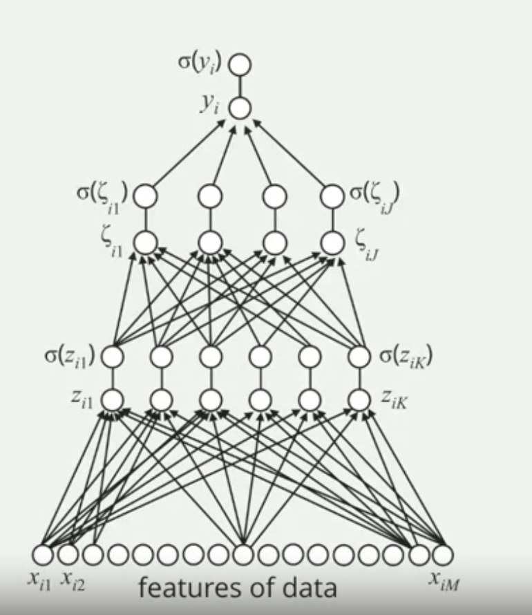

# Introduction

My learning from the Coursera Machine Learning course offered by Duke University.

## What is AI/ML

**Artificial Intelligence (AI):**
Artificial Intelligence is a broader field of computer science that aims to create machines that can mimic or simulate human intelligence. This includes reasoning, problem-solving, perception, language understanding, and even potentially creativity.

**Machine Learning (ML):**
Machine Learning is a subset of artificial intelligence that focuses on the development of algorithms and models that enable computers to perform tasks without being explicitly programmed. It allows systems to learn and improve from experience, typically using data.

Machine Learning is a core component of AI. While AI encompasses a broader vision of machines being intelligent, ML provides the methods and techniques to make that vision a reality. In other words, ML is one of the ways we achieve AI. Think of AI as the universe with ML as one of its vital galaxies. 

- ### Definition and Basics
  
  - What is machine learning?
  Machine learning is like teaching a computer by showing it examples. We give it some data, like a list of numbers, and then tell it what we want it to guess or predict based on that data. For this example, the computer's guess is labeled as 'y', and it can be either a zero or a one. But it can guess other things too, not just zeros and ones.

  - Supervised vs. unsupervised learning.

    ***Supervised Learning:***
    - It's like giving the computer a study guide. You show it the question (input) and the right answer (output). Then, you test it to see if it learned.
    - Used when we know the correct answer beforehand and want the computer to learn from it.

    ***Unsupervised Learning:***
    - It's like giving the computer a bunch of puzzles without solutions. It tries to find patterns or group things together on its own.
    - Used when we don't have the answers, but we want the computer to find hidden structures in the data.

- ### Applications

  ***Real-world examples of machine learning:***
        - Streaming platforms like Netflix and Spotify utilize machine learning algorithms to curate personalized content recommendations for users.
        - Email platforms employ machine learning to effectively filter out spam and categorize incoming messages.
        - Autonomous vehicles leverage machine learning to process vast amounts of data in real-time, enabling them to navigate and make decisions on the road.

  ***Data Point:***
        - Numerous industries are reaping the benefits of integrating machine learning into their operations. From healthcare diagnostics to financial forecasting, machine learning is revolutionizing traditional processes. According to certain industry reports, businesses that effectively implement machine learning strategies can witness an increase in profitability by up to 20%.

  In essence, machine learning is playing an instrumental role in enhancing various sectors, driving efficiency, and fostering innovation.

## Logistic Regression

Logistic Regression is a type of machine learning model that helps us predict the probability of something being true or false, like if a picture is of the number 1 or 0. Taking the MNIST Data Set, the training data is manifested by images of 0 or 1 and a true label. The logistic regression model is trained to predict 0 or 1.

1. Learning the Filter: The model learns a "filter" from the data it's trained on. This filter is a set of parameters, represented by the letter 'b'. If you visualize it, the filter might look a lot like the number for our example.

2. Matching with the Filter: To figure out if a new picture is a 1 or 0, the model multiplies the picture's pixels with the filter's parameters. This process is called taking an "inner product." It's like checking how well the picture matches with the filter.

3. Getting a Score: After multiplying, the model sums everything up to get a score. This score tells us how strong the match is between the picture and the filter.

4. Converting Score to Probability: The score is then passed through a special function called the "sigmoid" or "logistic" function. This function changes the score into a probability, which is a number between 0 and 1. A high probability means the picture probably is a 1, and a low probability means it's probably a 0.

Logistic Regression uses a process where data is matched with a filter and then passed through a function called the "sigmoid function." This helps determine the probability of something, like if a picture is of the number 1. This basic idea is super important and is used even in more advanced stuff like deep learning.

- **Challenges and Limitations:**
  Logistic Regression is used in various applications, and its success rate can vary. It performs well when the data points represented by red and blue dots can be separated by a straight line.

  

```
  zi= (b[1] * x[i1]) + (b[2] * x[i2]) +..............+(b[M] * x[iM])
  output= sigmoid(z~i~)
```

## Multilayer Perceptron

  Sometimes, a simple straight line won't work because the dots are all mixed up in a complex way. That's where Logistic Regression has its limits and we have to look at more complex models. In the multilayer perceptron model, we're taking the idea from logistic regression and leveling it up. Instead of applying the process just once, we do it multiple times (like 'k' times). This gives us a set of 'k' features or "latent processes" from our data. These features represent hidden characteristics in the data that we can't directly see.

  After getting these 'k' features, we then use logistic regression on them to predict the final outcome, like if a picture is of a certain number.

  For example, if we tried using regular logistic regression on pictures of the number four, our model might come up with a filter that looks like an "average" four. But this average doesn't really match any real pictures of fours. So, instead, with the multilayer perceptron, we can have multiple filters (like three of them) that capture different styles of writing the number four. This way, our model can recognize a four, no matter how it's written.

  In short, the multilayer perceptron is like a supercharged version of logistic regression, using multiple filters to better understand and predict data.

  Project data x[i] onto K filters: b[1]......b[K] ****
  ```
  z[i1] = b[01] + x[i] dotproduct b[1]
  z[i2] = b[02] + x[i] dotproduct b[2]
  .
  .
  .
  z[iK] = b[0K] + x[i] dotproduct b[K]
  ```
  Sigmoid of each of the projections
  ```
  o[1] = sigmoid(z[i1])
  o[2] = sigmoid(z[i2])
  .
  .
  o[K] = sigmoid(z[iK])
  ```
  These are the latent features then they are sent to single sigmoid function just like logisti regression

  ```
  theta[i] = c[0]= sigmoid(z[i]) dotproduct c
  ```

  Incorporating this intermediate layer enhances the model's adaptability. Specifically, it enables the model to recognize non-linear decision boundaries in the feature space, often leading to improved performance and accuracy.

## Deep Learning
Deep learning is a form of machine learning where our model is deep in the sense that it has multiple layers of latent processes. At the top, we have a logistic regression classifier, which is giving us the probability of the binary output Y equal one or Y equals zero.     



With this more complicated multilayer perceptron, it turns out that we can learn decision boundaries which are far more sophisticated. 


## Interpretation of Multi-layer Perceptrons and Transfer Learning

  In the realm of machine learning, the multi-layer perceptron stands out as a powerful tool, especially when predicting preferences. Imagine wanting to predict whether an individual would like or dislike a document. The preference is often influenced by the presence of certain topics or meta-topics within the document and the individual's affinity towards them.

  However, when scaling this prediction across multiple individuals, the multi-layer perceptron showcases its true potential. The initial layers of our model primarily focus on identifying the topics and meta-topics within the documents. Interestingly, these layers are more about the documents themselves rather than the individuals. This means that when building predictive models for multiple people, the parameters associated with these initial layers can be reused or shared. This approach is highly efficient, as it allows the leveraging of data from various individuals to understand and characterize the documents.

  On the other hand, the top layer of the model, which determines an individual's specific preferences towards the identified meta-topics, remains unique to each person.

  This architecture introduces a concept known as **transfer learning**. Instead of isolating data from each individual to build separate models, transfer learning enables the utilization of collective data to inform the foundational layers of the model. Only the final layer, which is person-specific, requires individual data. This not only ensures efficient use of data but also enhances the model's robustness.

  Beyond the inherent advantages of deep learning, like crafting sophisticated decision boundaries, the multi-layer perceptron offers the added benefit of transfer learning. This approach maximizes data utility, ensuring that every piece of information is harnessed to its fullest potential.


## Learning Steps


1. **Initialization:**
   - Start with initial values for the model's parameters (weights and bias). These can be set to zero, small random numbers, or based on some other initialization technique.

2. **Model Prediction:**
   - For a given input \( X \), compute the linear combination of the input features and the weights, and then pass this through the logistic (sigmoid) function to get the predicted probability \( p(y) \).
   - The logistic function ensures the output is between 0 and 1, making it interpretable as a probability.

3. **Compute Loss:**
   - Using the predicted probability \( p(y) \) and the true label \( y \), compute the loss using the Binary Cross-Entropy loss function. It quantifies the difference between the predicted probabilities and the actual class labels.

    Given:
    - \( y \) as the true label (0 or 1)
    - \( p(y) \) as the predicted probability of the label being 1

    The Binary Cross-Entropy loss for a single data point is:

    \[ L(y, p(y)) = -[y \log(p(y)) + (1 - y) \log(1 - p(y))] \]

    Here's a breakdown:

    - If \( y = 1 \): The loss is \( -\log(p(y)) \). As \( p(y) \) approaches 1, the loss goes to 0, which is what we want.
    - If \( y = 0 \): The loss is \( -\log(1 - p(y)) \). As \( p(y) \) approaches 0, the loss goes to 0, aligning with our desired outcome.

    In essence, the loss function penalizes predictions that are far from the true labels, guiding the model to adjust its weights during training to make better predictions.

4. **Calculate Gradients:**
   - Compute the gradient of the loss concerning each parameter. This step involves taking the derivative of the loss function with respect to each weight and bias. The gradient points in the direction of the steepest increase of the loss function.

5. **Update Parameters:**
   - Adjust the weights and bias in the opposite direction of the computed gradient. This is done to minimize the loss. The size of the step is determined by the learning rate.
   - Weight update rule: \( w_{new} = w_{old} - \text{learning rate} \times \text{gradient} \)

6. **Iterate:**
   - Repeat steps 2 to 5 for a set number of iterations or until the change in loss between iterations is below a predefined threshold.

7. **Model Evaluation:**
   - After training, evaluate the performance of the logistic regression model on a separate validation or test dataset to ensure it generalizes well to new, unseen data.

8. **Tuning (if necessary):**
   - If the model's performance is not satisfactory, consider adjusting hyperparameters (like the learning rate), adding regularization, or gathering more data, and then repeat the learning process.

## Bias-Variance Tradeoff

In the world of machine learning, the bias-variance tradeoff is a fundamental concept that every model grapples with. It's the balancing act between a model's ability to fit training data (bias) and its ability to generalize well to new, unseen data (variance).

**Logistic Regression:**
This is a linear model, and its simplicity often leads to high bias. It assumes a linear decision boundary, which means it might not capture complex patterns in the data. As a result, logistic regression can underfit, especially when the true relationship is non-linear. However, its simplicity often ensures low variance, making it less prone to overfitting and more consistent in predictions across different datasets.

**Multi-layer Perceptron (MLP):**
MLP, a basic form of neural network, introduces non-linearity and can model more complex relationships. This reduces the bias as it can fit the training data more closely. However, with its increased complexity, an MLP can have higher variance. If not properly regulated, it might overfit the training data, capturing noise and making it less generalizable to new data.

In essence, while logistic regression leans towards higher bias (but lower variance), multi-layer perceptrons tend to reduce bias at the potential cost of increased variance. The key is to find the right balance, ensuring models are neither too simplistic nor too complex, to achieve optimal performance on unseen data.

## Conclusion

Machine learning, though studied for years, has recently surged in prominence, largely due to advancements in computational power and availability of training data. The 

This is evident in tasks like image analysis where deep learning models excel in labeling intricate images. The ImageNet Challenge, a benchmark for image recognition, highlighted a significant performance leap around 2012, attributed to deep learning innovations. These techniques now even outpace human accuracy in some tasks. The impact extends beyond just images. In medicine, machine learning has sometimes surpassed doctors in diagnosing from images. Additionally, in the gaming world, deep learning has achieved the once-thought-impossible: defeating top human players in the ancient game of Go.

## References

- [Coursera Duke University course](https://www.coursera.org/learn/machine-learning-duke/lecture/wTcui/hierarchical-structure-of-images)
