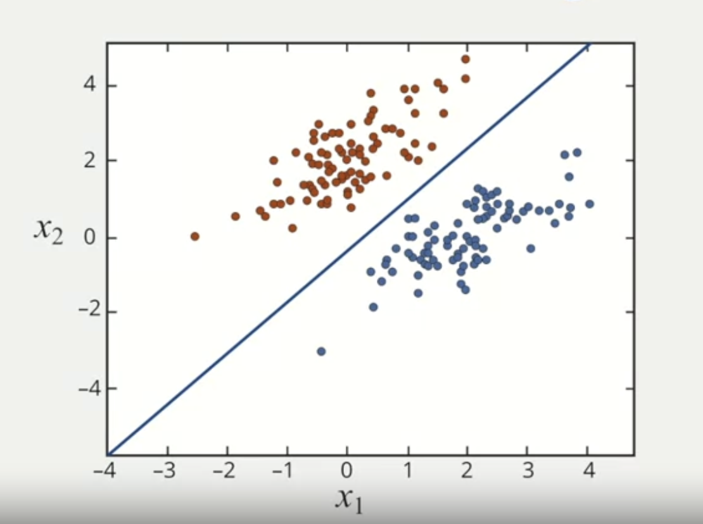
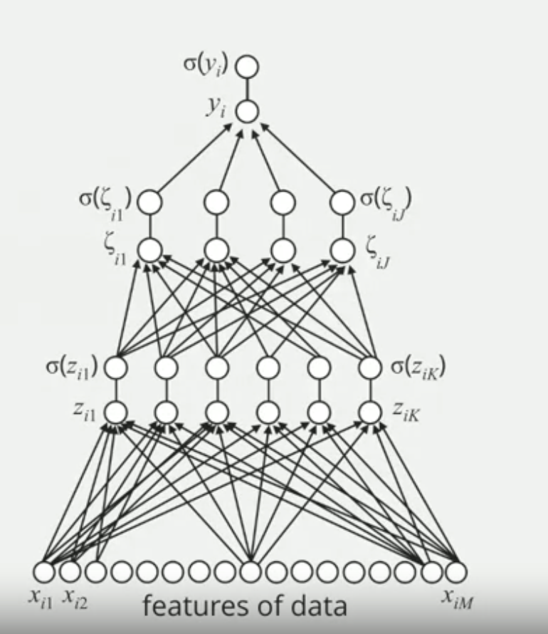
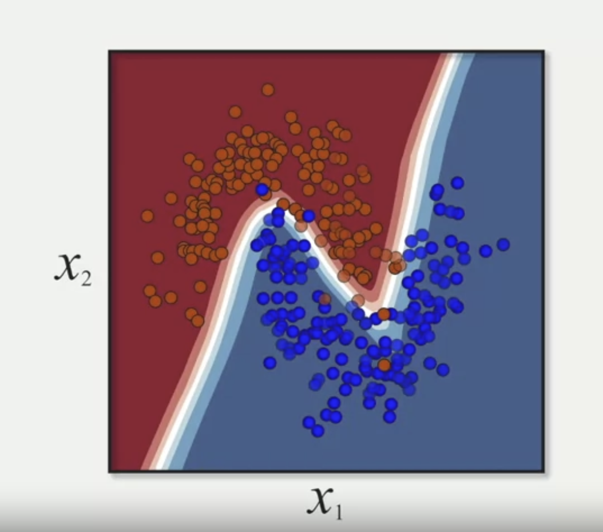

---
Key Takeaways from Duke University's Machine Learning Course on Coursera

---


**Introduction:**

Machine learning has been studied for decades, but it's only recently that it's gained significant attention. One of the reasons is the advancements in a subfield called deep learning, especially in tasks like image analysis. For instance, deep learning models can now analyze complex images and accurately label them.

There's a benchmark called the ImageNet Challenge that measures how well different methods can identify objects in images. A graph from this challenge showed that around 2012, there was a notable improvement in performance. This was largely due to the introduction of deep learning techniques. Impressively, these methods have reached a point where their accuracy surpasses that of the average human.

Beyond image recognition, machine learning has shown promise in medical fields, such as ophthalmology and dermatology. In some instances, it's even outperformed medical professionals in image-based diagnoses. Another remarkable achievement is in the realm of games. The ancient game of Go, predominantly played in Asia, was once believed to be too complex for machines. However, in recent years, deep learning models have not only competed with but also defeated some of the world's best human Go players.

In essence, the recent achievements of machine learning, particularly deep learning, in outperforming human capabilities in certain tasks, are the driving forces behind its growing excitement and interest.


**1. Introduction to Machine Learning:**
- **Definition and Basics:**
  - What is machine learning?
  Machine learning is like teaching a computer by showing it examples. We give it some data, like a list of numbers, and then tell it what we want it to guess or predict based on that data. For this example, the computer's guess is labeled as 'y', and it can be either a zero or a one. But it can guess other things too, not just zeros and ones.

  - Supervised vs. unsupervised learning.

    ***Supervised Learning:***
    - It's like giving the computer a study guide. You show it the question (input) and the right answer (output). Then, you test it to see if it learned.
    - Used when we know the correct answer beforehand and want the computer to learn from it.

    ***Unsupervised Learning:***
    - It's like giving the computer a bunch of puzzles without solutions. It tries to find patterns or group things together on its own.
    - Used when we don't have the answers, but we want the computer to find hidden structures in the data.


---
- **Applications:**


    ***Real-world examples of machine learning:***
      - Streaming platforms like Netflix and Spotify utilize machine learning algorithms to curate personalized content recommendations for users.
      - Email platforms employ machine learning to effectively filter out spam and categorize incoming messages.
      - Autonomous vehicles leverage machine learning to process vast amounts of data in real-time, enabling them to navigate and make decisions on the road.

      ***Data Point:***
      - Numerous industries are reaping the benefits of integrating machine learning into their operations. From healthcare diagnostics to financial forecasting, machine learning is revolutionizing traditional processes. According to certain industry reports, businesses that effectively implement machine learning strategies can witness an increase in profitability by up to 20%.

  In essence, machine learning is playing an instrumental role in enhancing various sectors, driving efficiency, and fostering innovation.


---

**2. Logistic Regression:**
- **Basics:**
  - What is logistic regression?

    ***Logistic Regression:***

    Logistic Regression is a type of machine learning model that helps us predict the probability of something being true or false, like if a picture is of the number 1 or 0. Taking the MNIST Data Set, the training data is manifested by images of 0 or 1 and a true label. The logistic regression model is trained to predict 0 or 1.  

    1. **Learning the Filter:** The model learns a "filter" from the data it's trained on. This filter is a set of parameters, represented by the letter 'b'. If you visualize it, the filter might look a lot like the number 1 for our example.

    2. **Matching with the Filter:** To figure out if a new picture is a 1 or 0, the model multiplies the picture's pixels with the filter's parameters. This process is called taking an "inner product." It's like checking how well the picture matches with the filter.

    3. **Getting a Score:** After multiplying, the model sums everything up to get a score. This score tells us how strong the match is between the picture and the filter.

    4. **Converting Score to Probability:** The score is then passed through a special function called the "sigmoid" or "logistic" function. This function changes the score into a probability, which is a number between 0 and 1. A high probability means the picture probably is a 1, and a low probability means it's probably a 0.

    In short, Logistic Regression uses a process where data is matched with a filter and then passed through a function called the "sigmoid function." This helps determine the probability of something, like if a picture is of the number 1. This basic idea is super important and is used even in more advanced stuff like deep learning.
  

- **Challenges and Limitations:**
  Logistic Regression is used in various applications, and its success rate can vary. It performs well when the data points represented by red and blue dots can be separated by a straight line.

  
    
  Sometimes, a simple straight line won't work because the dots are all mixed up in a complex way. That's where Logistic Regression has its limits. It's great when a straight line can separate things, but not so much when things get complicated.


  ```
  zi= (b[1] * x[i1]) + (b[2] * x[i2]) +..............+(b[M] * x[iM])
  output= sigmoid(z~i~)
  ```

***Multilayer Perceptron:***

  In the multilayer perceptron model, we're taking the idea from logistic regression and leveling it up. Instead of applying the process just once, we do it multiple times (like 'k' times). This gives us a set of 'k' features or "latent processes" from our data. These features represent hidden characteristics in the data that we can't directly see.

  After getting these 'k' features, we then use logistic regression on them to predict the final outcome, like if a picture is of a certain number.

  For example, if we tried using regular logistic regression on pictures of the number four, our model might come up with a filter that looks like an "average" four. But this average doesn't really match any real pictures of fours. So, instead, with the multilayer perceptron, we can have multiple filters (like three of them) that capture different styles of writing the number four. This way, our model can recognize a four, no matter how it's written.

  In short, the multilayer perceptron is like a supercharged version of logistic regression, using multiple filters to better understand and predict data.


  Project data x[i] onto K filters: b[1]......b[K] ****
  ```
  z[i1] = b[01] + x[i] dotproduct b[1]
  z[i2] = b[02] + x[i] dotproduct b[2]
  .
  .
  .
  z[iK] = b[0K] + x[i] dotproduct b[K]
  ```
  Sigmoid of each of the projections
  ```
  o[1] = sigmoid(z[i1])
  o[2] = sigmoid(z[i2])
  .
  .
  o[K] = sigmoid(z[iK])
  ```
  These are the latent features then they are sent to single sigmoid function just like logisti regression

  ```
  theta[i] = c[0]= sigmoid(z[i]) dotproduct c
  ```

  Incorporating this intermediate layer enhances the model's adaptability. Specifically, it enables the model to recognize non-linear decision boundaries in the feature space, often leading to improved performance and accuracy.
---

**3. Deep Learning:**
- **Introduction to Neural Networks:**
  - Basic structure: input layer, hidden layers, output layer.
- **Training Deep Networks:**
  - Backpropagation and gradient descent.
  - *Data Point:* Comparison of training times or accuracy with traditional methods.
- **Applications:**
  - Image recognition, speech recognition, and more.
  - *Data Point:* Improvements in accuracy rates over the years.

---

**4. Convolutional Neural Networks (CNNs):**
- **Basics:**
  - What are CNNs and how do they differ from regular neural networks?
- **Key Components:**
  - Convolutional layers, pooling layers, fully connected layers.
- **Applications:**
  - Image classification, facial recognition, video analysis.
  - *Data Point:* Benchmark results of CNNs in popular datasets like ImageNet.
- **Challenges:**
  - Computational requirements, overfitting.

---

**5. Natural Language Processing (NLP):**
- **Introduction:**
  - What is NLP and its significance?
- **Key Techniques:**
  - Tokenization, word embeddings, recurrent neural networks (RNNs).
- **Applications:**
  - Chatbots, sentiment analysis, machine translation.
  - *Data Point:* Accuracy improvements in machine translation over the years.
- **Challenges:**
  - Handling sarcasm, cultural nuances, and idiomatic expressions.

---

**Conclusion:**
- Recap of the main points covered.
- The future potential of machine learning and its subfields.
- Encouragement for readers to delve deeper and explore the course.

---

**References:**
- List of all the sources, including the Coursera course, and any additional data or research you've mentioned.


MULTI LAYER PERCEPTRON


##Deep Learning
So, deep learning is a form of machine learning where our model is deep in the sense that it has multiple layers of latent processes. Then in a subsequent example, will explain given in some intuition as to what these latent processes mean. Always at the top, we have a logistic regression classifier, which is giving us the probability of the binary output Y equal one or Y equals zero.     



But recall that the logistic regression had limitations. One of those limitations was that the decision boundary between the two the types of data, the Y equal one and Y equals zero was required to be linear, a line. So, with this more complicated multilayer perceptron, it turns out that we can learn decision boundaries which are far more sophisticated. 

