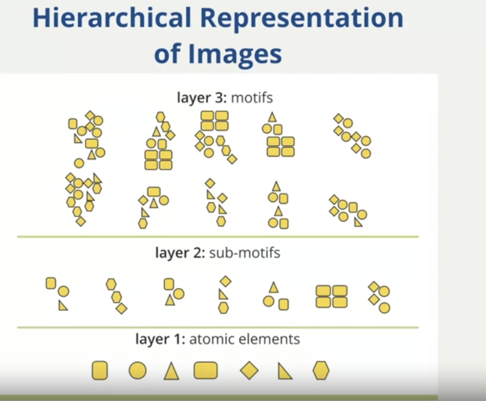
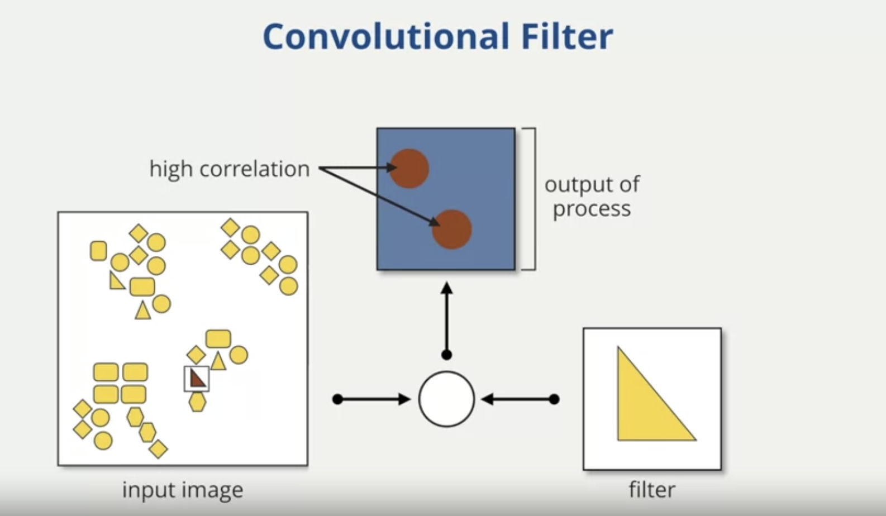
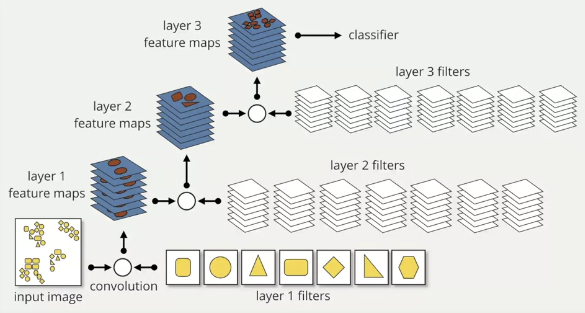

# Introduction

My learning from the Coursera Machine Learning course offered by Duke University.

## Convolutional Neural Networks (CNNs)

A Convolutional Neural Network (CNN) is a type of deep learning algorithm specifically designed for processing structured grid data, such as images. It's characterized by its use of convolutional layers, which automatically and adaptively learn spatial hierarchies of features from input images. CNNs are especially powerful for tasks like image recognition because they can efficiently handle the high dimensionality of images and capture local spatial correlations through their unique architecture.

***Hierarchical Structure of Images***
Images in the real world have certain structures that are repeated such as edges, corners, textures, shapes, this is characteristic of all virtually all natural images. This characteristic is something that can be leveraged or exploited in the context of the deep convolutional neural network.

## Why CNNs instead of NNs for images

You can process images with deep neural networks (DNNs), but there are specific reasons why Convolutional Neural Networks (CNNs) are more commonly used for this purpose:

1. **Parameter Efficiency:** Images can have thousands or millions of pixels. If you use a standard DNN, the first hidden layer would require a weight for every pixel for every neuron, leading to a massive number of parameters. CNNs, with their shared weights in convolutional layers, drastically reduce the number of parameters, making them more efficient.

2. **Spatial Hierarchies:** CNNs are designed to automatically and adaptively learn spatial hierarchies of features. The convolutional layers can capture local patterns like edges, textures, and more, which are then combined in deeper layers to recognize larger structures.

3. **Translation Invariance:** CNNs, through their pooling layers, can recognize features irrespective of their position in the image. This means if a feature, like an edge or a texture, moves around in the image, a CNN can still recognize it.

4. **Dimensionality Reduction:** CNNs, through pooling layers, can reduce the spatial size of the representation, condensing the information while retaining the important features.

5. **Overfitting Prevention:** Due to the reduced number of parameters compared to standard DNNs, CNNs are less prone to overfitting, especially when dealing with a limited dataset.

While DNNs can be used for image processing, CNNs are specifically tailored for it, offering better efficiency, performance, and often superior results.

## Convolution Filters in image processing

A convolution filter, often referred to as an "atomic element" or simply "filter", is a tool used in image processing to detect specific features or patterns in an image. Taking an example where we are detecting triangles in the image, we apply a traingle shaped filter.

To apply this filter, we slide or "shift" it across every possible position of the image, calculating a correlation at each step. This correlation measures how similar the local region of the image is to our triangular filter.

When the filter aligns perfectly with a similar shape or feature in the image, the correlation is high, indicating a strong match. For instance, in the provided example, there are two positions in the image where the triangular shape is present. At these positions, the correlation is at its peak.

The result of this entire process is a "feature map" displayed at the top. This map visually represents the degree of match or correlation between the filter and every location in the image. High values on this map indicate regions where the triangular feature is detected, and lower values indicate less or no match.

The process by which the atomic element, in this case, the triangle, is shifted to every location in the image is called convolution. This is why the name convolutional neural network. The convolution is manifested by shifting that filter to every location in the image.

Applying different filters, or atomic elements results in multiple feature maps. The layer 1 feature map is convolved with layer 2 filters that combine layer 1 atomic elemnets or filters. The process is repeated with the filters becoming more complex at each layer. The classification decision will be based upon the features at the top of the mode.

- **How the model learns:**

  - Availability of Labeled data.
  - Predicted value - the value the model predicts.
  - Risk/Loss Function - The loss is essentially the difference between the accuracy of the predicted labels and the true labels.
  - Model parameters - The model learns the parameters that reduces the total loss between the prediction and the label.

## Understanding Learning in Convolutional Neural Networks

Learning in the context of Convolutional Neural Networks (CNNs) is all about the machine fine-tuning itself to make accurate predictions. Imagine showing the network a series of images and their corresponding labels. The goal of the network is to adjust its internal settings, called parameters, so that its predictions closely match the actual labels of the images.

However, this learning journey isn't straightforward. Think of it as navigating a vast landscape with numerous hills and valleys. Each hilltop or valley represents a set of parameters, and the network's aim is to find the lowest valley (or the best set of parameters). But there's a catch: there are countless such valleys, and not all are equal. Some are deeper (better) than others, and finding the deepest one is challenging, especially when dealing with numerous parameters.

This complex landscape, with its many local optimal solutions, makes the learning process intricate. Even though we're simplifying it to two parameters for illustration, in reality, there are thousands, making the search incredibly vast and intricate. Perfecting this search has been the result of decades of dedicated research, and it's what makes modern CNNs so powerful.

## Key Components

**1. Convolutional Layers:**
The heart and namesake of CNNs, convolutional layers are responsible for scanning an input image with small, learnable filters. By sliding these filters over the image, the network can detect specific features like edges, textures, and patterns. As we go deeper into the network, these layers can recognize more complex and abstract features.

**2. Filters:**
Filters, sometimes referred to as kernels, are small matrices that are used in the convolutional layers. They transform portions of the input image, emphasizing certain features. For instance, one filter might be adept at highlighting vertical edges, while another might focus on horizontal ones. As the network trains, these filters adjust themselves to better recognize and emphasize important features in the input data.

**3. Pooling Layers:**
After detecting features with the convolutional layers, we often have a lot of information to process. Pooling layers help reduce this information, making the network more efficient. A common method, called "max pooling," involves selecting the maximum value from a group of values in the feature map. This process reduces the spatial dimensions of the data while retaining the most critical information, ensuring that the network remains computationally efficient.

**4. Fully Connected Layers:**
After the convolutional and pooling layers have done their job of feature detection and reduction, the fully connected layers come into play. These layers take the high-level features identified by the previous layers and combine them to make a final decision, like classifying an image. Imagine them as the decision-making brains of the network, synthesizing all the insights from the data to produce a final output.

In essence, a CNN is a harmonious blend of these components, each playing its part to transform raw image data into meaningful insights or classifications. The beauty of CNNs lies in their ability to automatically and adaptively learn spatial hierarchies of features, making them a cornerstone in modern image processing tasks.

## The Evolution and Mastery of Convolutional Neural Networks in Image Classification and Beyond

Deep learning, particularly through Convolutional Neural Networks (CNNs), has revolutionized the way machines interpret images. While the foundational concepts of CNNs were established around 1989, it wasn't until 2013 that a confluence of computational power, advanced algorithms, and vast datasets brought them to the forefront of technology.

A prime example of this evolution is the ImageNet Dataset challenge. This dataset comprises a staggering one million images, spread across 1,000 diverse classes. The challenge? To classify these intricate images into their respective categories. While initial models before 2012 had a commendable performance, the introduction of CNNs around 2012-2013 marked a significant leap in accuracy. By 2017, these networks not only matched but surpassed human-level performance, with accuracy rates exceeding 95%.

To grasp the prowess of CNNs, consider this: given an image, the model can predict its category and even provide probabilities for its top five predictions. When the results are sent through NLP, it produces a natural language description of the images.

The applications of CNNs aren't limited to just image classification. A notable achievement was in the realm of the ancient game, Go. Historically revered and considered too complex for machines, Go presented a unique challenge. However, DeepMind, a UK-based company, developed an algorithm rooted in CNN technology. This algorithm could analyze the Go board and suggest optimal moves. When pitted against world-class Go players, the machine showcased a prowess that many thought was decades away, further solidifying the unmatched potential of CNNs in diverse applications.

## Uses

- Image Analysis for medical imaging for ophthalmology e.g. diabetic retinopathy, dermatology and radilogy
- Transfer Learning where neural netwroks designed for Imagenet are tarnsferred for learning parameters applicable for medical imaging.
- Cancer Diagnosis

## Conclusion

Machine learning, though studied for years, has recently surged in prominence, largely due to advancements in deep learning. This is evident in tasks like image analysis where deep learning models excel in labeling intricate images. The ImageNet Challenge, a benchmark for image recognition, highlighted a significant performance leap around 2012, attributed to deep learning innovations. These techniques now even outpace human accuracy in some tasks. The impact extends beyond just images. In medicine, machine learning has sometimes surpassed doctors in diagnosing from images. Additionally, in the gaming world, deep learning has achieved the once-thought-impossible: defeating top human players in the ancient game of Go.

## References
- [Coursera Duke University course](https://www.coursera.org/learn/machine-learning-duke/lecture/wTcui/hierarchical-structure-of-images)
